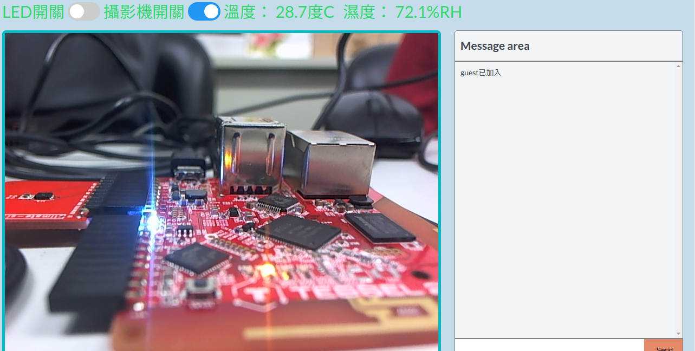

# Smart furniture

## To Start
1. 確保server(Tessel) 和 client 連接到的是同一個wifi網域
2. 先輸入t2 wifi找到他們連接到的wifi IP (本範例為:192.168.43.105)

  

3. 輸入t2 run server.js來執行程式
4. 在client(browser)輸入 wifiIP:3000 本範例為: 192.168.43.105:3000

  

5. 完成
